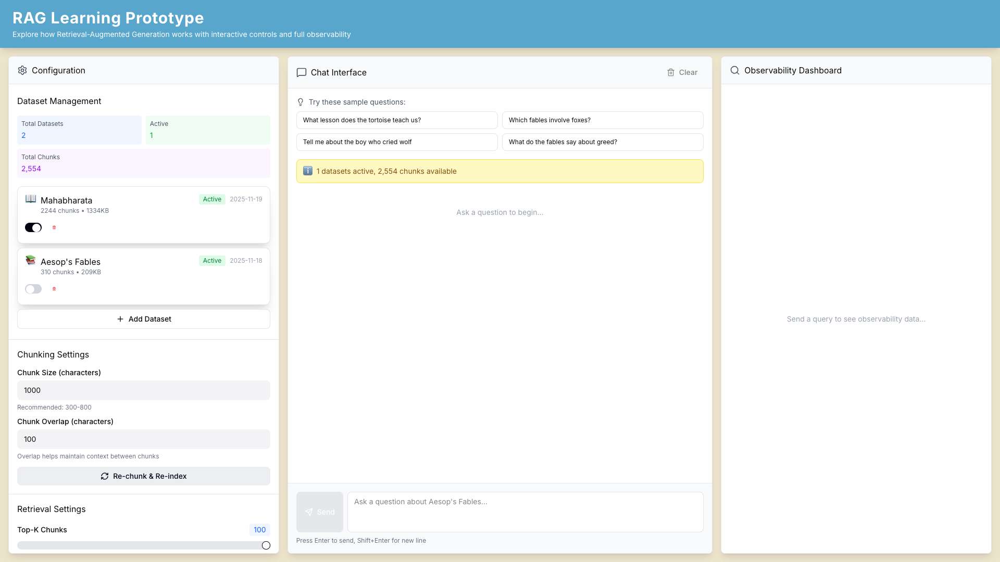
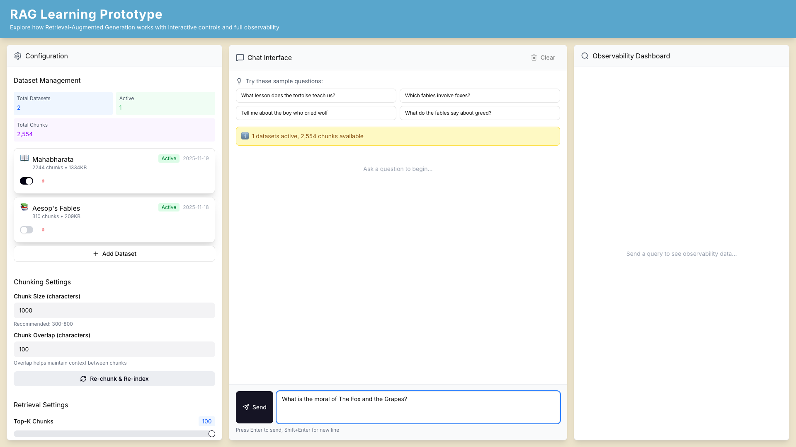

# RAG Learning Prototype - Project Overview

## Introduction

This is a complete, production-ready Retrieval-Augmented Generation (RAG) system designed for learning and experimentation. Built with Aesop's Fables as the default dataset, it provides full observability into every step of the RAG pipeline, making it an ideal educational tool for understanding how modern AI-powered question-answering systems work.

## Screenshots


*Main interface showing the three-panel layout: Configuration (left), Chat (center), and Observability (right)*


*Example query demonstrating the interactive chat interface*

---

## Feature Set

### 1. Complete RAG Pipeline
- **End-to-End Processing**: From raw documents to contextualized AI responses
- **Three Core Stages**:
  - Embedding generation using Sentence Transformers
  - Vector similarity search with ChromaDB
  - LLM-powered response generation via OpenAI API
- **Real-time Processing**: Queries processed in seconds with live feedback

### 2. Full Observability Dashboard
Track every aspect of the RAG pipeline:
- **Performance Metrics**:
  - Latency breakdown for each pipeline stage (embedding, retrieval, generation)
  - Total end-to-end response time
  - Token usage and API costs
- **Retrieved Context**:
  - View all chunks retrieved from the vector database
  - Similarity scores for each retrieved chunk
  - Source attribution and metadata
- **LLM Transparency**:
  - Complete prompt sent to the language model
  - Model parameters (temperature, max tokens, model name)
  - Token breakdown (prompt tokens vs completion tokens)
  - Cost calculation per query
- **Timeline Visualization**: Visual representation of where time is spent in the pipeline

### 3. Dynamic Dataset Management
- **Multi-Dataset Support**: Upload and manage multiple document collections simultaneously
- **Flexible File Formats**: Supports .txt, .pdf, .docx, and .md files
- **Configurable Chunking**:
  - Adjustable chunk size (100-2000 characters)
  - Configurable chunk overlap (0-500 characters)
  - Two chunking strategies:
    - **Sentence-based**: Preserves natural language boundaries
    - **Character-based**: Fixed-size chunks for uniform distribution
- **Dataset Controls**:
  - Enable/disable datasets without deletion
  - Real-time dataset switching during queries
  - Persistent storage with SQLite

### 4. Real-Time Configuration
Adjust RAG parameters on-the-fly without restarting:

**Retrieval Settings**:
- Top-K (1-20): Number of most relevant chunks to retrieve
- Min Score (0.0-1.0): Minimum similarity threshold for relevance

**LLM Settings**:
- Model selection: GPT-4o, GPT-4o-mini, or GPT-3.5-turbo
- Temperature (0.0-2.0): Control randomness and creativity
- Max tokens (50-4000): Limit response length

### 5. Evaluation & Quality Assurance
- **Manual Feedback**: Thumbs up/down rating for each response
- **Persistent Evaluations**: All ratings saved for analysis
- **Batch Evaluation**: Test with predefined question sets
- **API Access**: Programmatic evaluation via REST endpoints

### 6. Modern, Responsive UI
- **Three-Panel Layout**:
  - Left: Configuration and dataset management
  - Center: Interactive chat interface
  - Right: Real-time observability dashboard
- **Built with**:
  - React 18 with TypeScript for type safety
  - Tailwind CSS for responsive design
  - Lucide React for consistent iconography
- **Professional Design**: Custom color scheme with excellent readability

---

## Technical Implementation

### Architecture Overview

The system follows a clean, modular architecture with clear separation of concerns:

```
┌─────────────────────────────────────────────────────────────┐
│                      Frontend (React)                        │
│  ┌────────────┐  ┌──────────────┐  ┌──────────────────┐    │
│  │   Config   │  │     Chat     │  │  Observability   │    │
│  │   Panel    │  │  Interface   │  │    Dashboard     │    │
│  └────────────┘  └──────────────┘  └──────────────────┘    │
└─────────────────────────────────────────────────────────────┘
                            │ HTTP/REST
                            ▼
┌─────────────────────────────────────────────────────────────┐
│                   Backend (FastAPI)                          │
│                                                               │
│  ┌────────────────────────────────────────────────────┐     │
│  │              API Layer (Endpoints)                  │     │
│  │  /chat  /datasets  /config  /evaluate  /health    │     │
│  └────────────────────────────────────────────────────┘     │
│                            │                                 │
│  ┌────────────────────────────────────────────────────┐     │
│  │            RAG Pipeline Orchestration               │     │
│  │  (Coordinates: Embedding → Retrieval → LLM)       │     │
│  └────────────────────────────────────────────────────┘     │
│                            │                                 │
│  ┌──────────────┐  ┌──────────────┐  ┌──────────────┐      │
│  │  Embedding   │  │    Vector    │  │     LLM      │      │
│  │   Service    │  │    Store     │  │   Client     │      │
│  │ (Sentence    │  │  (ChromaDB)  │  │  (OpenAI)    │      │
│  │ Transformers)│  │              │  │              │      │
│  └──────────────┘  └──────────────┘  └──────────────┘      │
│                                                               │
│  ┌────────────────────────────────────────────────────┐     │
│  │          Services & Data Layer                      │     │
│  │  Chunking | Ingestion | Evaluation | Database     │     │
│  └────────────────────────────────────────────────────┘     │
└─────────────────────────────────────────────────────────────┘
                            │
                            ▼
              ┌──────────────────────────────┐
              │    Persistent Storage         │
              │  ChromaDB (vectors)           │
              │  SQLite (metadata, datasets)  │
              └──────────────────────────────┘
```

### Backend Technical Stack

#### 1. API Framework: FastAPI
- **Why FastAPI**: High performance, automatic API documentation, async support, strong type validation
- **Key Features Used**:
  - Pydantic models for request/response validation
  - Automatic OpenAPI/Swagger documentation at `/docs`
  - CORS middleware for frontend integration
  - Dependency injection for service management
- **Main Entry Point**: `backend/app/main.py`

#### 2. Embedding Service: Sentence Transformers
- **Model**: `all-MiniLM-L6-v2`
  - Dimensions: 384
  - Fast, lightweight, runs locally
  - No API costs or internet dependency after initial download
- **Implementation**: `backend/app/core/embeddings.py`
- **Features**:
  - Batch processing for efficiency
  - Normalized embeddings for cosine similarity
  - Singleton pattern for model reuse
  - Progress bars for long operations

#### 3. Vector Database: ChromaDB
- **Why ChromaDB**: Simple, embedded, no separate server required
- **Implementation**: `backend/app/core/vector_store.py`
- **Features**:
  - Persistent storage on disk
  - Collection per dataset for isolation
  - Cosine similarity search
  - Metadata filtering for dataset selection
  - Efficient k-NN retrieval

#### 4. LLM Integration: OpenAI API
- **Implementation**: `backend/app/core/llm_client.py`
- **Supported Models**: GPT-4o, GPT-4o-mini, GPT-3.5-turbo
- **Features**:
  - Dynamic model selection
  - Token usage tracking
  - Cost calculation (accurate pricing per model)
  - Temperature and max_tokens control
  - Error handling and retry logic

#### 5. RAG Pipeline Orchestration
- **Implementation**: `backend/app/core/rag_pipeline.py`
- **Key Responsibilities**:
  - Coordinates the three-stage RAG process
  - Timing and performance tracking
  - Context formatting for LLM prompts
  - Complete observability data collection

**Pipeline Flow**:
```python
# Simplified pipeline logic
def query(user_query, config):
    # Stage 1: Embed the query
    query_vector = embedding_service.embed_query(user_query)

    # Stage 2: Retrieve relevant chunks
    chunks = vector_store.search(
        query_vector,
        top_k=config.top_k,
        min_score=config.min_score
    )

    # Stage 3: Build context and query LLM
    context = format_chunks(chunks)
    prompt = build_prompt(context, user_query)
    response = llm_client.generate(prompt, config)

    return response + observability_data
```

#### 6. Data Processing Services

**Chunking** (`backend/app/services/chunking.py`):
- Sentence-based chunking using NLTK
- Character-based chunking with overlap
- Configurable chunk size and overlap
- Preserves context boundaries

**Ingestion** (`backend/app/services/ingestion.py`):
- File parsing (PDF, DOCX, TXT, MD)
- Document chunking
- Batch embedding generation
- Vector database insertion
- Progress tracking

**Evaluation** (`backend/app/services/evaluation.py`):
- Store user ratings (thumbs up/down)
- Batch evaluation with test questions
- Query history and analytics

#### 7. Data Layer
**Database** (`backend/app/models/database.py`):
- SQLite for application data
- Stores:
  - Dataset metadata (name, file, chunking config)
  - Configuration settings
  - Evaluation history
- Async operations with aiosqlite

### Frontend Technical Stack

#### 1. React 18 with TypeScript
- **Why React**: Component reusability, efficient rendering, large ecosystem
- **Why TypeScript**: Type safety, better IDE support, fewer runtime errors
- **Main Component**: `frontend/src/App.tsx`

#### 2. Component Architecture
```
App.tsx (Root)
├── ConfigPanel.tsx
│   ├── Dataset management
│   ├── Retrieval settings
│   └── LLM configuration
├── ChatInterface.tsx
│   ├── Message history
│   ├── Query input
│   └── Sample questions
└── ObservabilityDashboard.tsx
    ├── Pipeline timeline
    ├── Retrieved chunks display
    └── LLM details & costs
```

#### 3. State Management
- React hooks (useState, useEffect)
- Prop drilling for simple state
- API service layer for data fetching
- Real-time updates on user actions

#### 4. Styling: Tailwind CSS
- Utility-first CSS framework
- Responsive design out of the box
- Custom color scheme:
  - Primary: `#59A6CC` (blue)
  - Background: `#EDE4CC` (cream)
  - Accents: Tailwind defaults
- No custom CSS files needed

#### 5. HTTP Client: Axios
- Promise-based HTTP requests
- Automatic JSON transformation
- Centralized API service: `frontend/src/services/api.ts`
- Error handling and loading states

#### 6. Build Tool: Vite
- Lightning-fast development server
- Hot module replacement (HMR)
- Optimized production builds
- ESM-native bundling

### Key Algorithms & Techniques

#### 1. Text Chunking
**Sentence-based Strategy**:
```
1. Split document into sentences (NLTK)
2. Group sentences until chunk_size reached
3. Add overlap by including previous sentences
4. Preserve complete sentence boundaries
```

**Character-based Strategy**:
```
1. Split text every chunk_size characters
2. Slide window with overlap
3. Simple but may break mid-sentence
```

#### 2. Vector Similarity Search
- **Metric**: Cosine similarity (dot product of normalized vectors)
- **Algorithm**: Approximate nearest neighbors (ChromaDB's HNSW)
- **Formula**: `similarity = dot(query_vector, document_vector)`
- **Range**: 0.0 (orthogonal) to 1.0 (identical)

#### 3. Context Construction
```
For each retrieved chunk:
    format = f"[Source {i}: {source} (relevance: {score})]\n{text}"

final_context = join_all_chunks_with_newlines
```

#### 4. Prompt Engineering
**System Prompt Template**:
```
You are a helpful assistant. Use the following context to answer the question.

Context:
{retrieved_chunks}

Question: {user_query}

Answer based on the context provided. If the context doesn't contain
relevant information, say so.
```

### Data Flow Example

Let's trace a query through the system:

1. **User Input**: "What is the moral of The Fox and the Grapes?"

2. **Frontend** (`ChatInterface.tsx`):
   ```typescript
   const response = await sendChatMessage(query, config);
   setMessages([...messages, {role: 'assistant', content: response.answer}]);
   setObservability(response.observability);
   ```

3. **API Endpoint** (`backend/app/api/endpoints/chat.py`):
   ```python
   @router.post("/chat")
   async def chat(request: ChatRequest):
       rag_pipeline = get_rag_pipeline()
       result = rag_pipeline.query(
           query=request.query,
           top_k=request.top_k,
           model=request.model,
           temperature=request.temperature
       )
       return result
   ```

4. **RAG Pipeline** (`backend/app/core/rag_pipeline.py`):

   **Stage 1 - Embedding** (10-50ms):
   ```python
   query_embedding = embedding_service.embed_query(query)
   # Returns: [0.123, -0.456, 0.789, ..., 0.234] (384 dimensions)
   ```

   **Stage 2 - Retrieval** (20-100ms):
   ```python
   chunks = vector_store.search(
       query_embedding,
       top_k=3,
       enabled_datasets=['aesop-fables']
   )
   # Returns: [
   #   {text: "A Fox saw some grapes...", score: 0.87, metadata: {...}},
   #   {text: "The moral of the story...", score: 0.82, metadata: {...}},
   #   {text: "Another fable about...", score: 0.76, metadata: {...}}
   # ]
   ```

   **Stage 3 - LLM Generation** (500-2000ms):
   ```python
   context = format_context(chunks)
   prompt = system_prompt.format(retrieved_chunks=context, user_query=query)
   response = llm_client.generate(prompt, model='gpt-4o-mini')
   # Returns: {
   #   text: "The moral is that people often...",
   #   prompt_tokens: 450,
   #   completion_tokens: 75,
   #   cost: 0.00023
   # }
   ```

5. **Response** (Back to Frontend):
   ```json
   {
     "answer": "The moral is that people often...",
     "observability": {
       "total_latency_ms": 1247,
       "steps": [
         {"name": "embedding", "latency_ms": 23, "details": {...}},
         {"name": "retrieval", "latency_ms": 67, "details": {...}},
         {"name": "llm_generation", "latency_ms": 1157, "details": {...}}
       ],
       "full_prompt": "You are a helpful assistant..."
     }
   }
   ```

6. **UI Updates**:
   - Chat panel shows the answer
   - Observability panel shows timing, chunks, costs
   - User can rate the response

---

## Configuration Files

### Backend Configuration
**File**: `backend/.env`
```bash
# OpenAI API
OPENAI_API_KEY=your-api-key-here

# Server
HOST=0.0.0.0
PORT=8000

# CORS
CORS_ORIGINS=http://localhost:5173

# Data
DATA_DIR=./data

# Models
EMBEDDING_MODEL=all-MiniLM-L6-v2
DEFAULT_LLM_MODEL=gpt-4o-mini
```

**File**: `backend/app/core/config.py`
- Pydantic Settings for type-safe configuration
- Environment variable loading
- Default values
- System prompt template

### Frontend Configuration
**File**: `frontend/.env`
```bash
VITE_API_BASE_URL=http://localhost:8000/api
```

**File**: `frontend/vite.config.ts`
- Development server settings
- Build optimization
- Plugin configuration

---

## Performance Characteristics

### Typical Query Latencies
- **Embedding**: 10-50ms (local model)
- **Retrieval**: 20-100ms (ChromaDB)
- **LLM Generation**: 500-2000ms (OpenAI API)
- **Total**: 530-2150ms end-to-end

### Bottlenecks
1. **LLM API**: Network latency + generation time (70-90% of total)
2. **Vector Search**: Scales with dataset size
3. **Embedding**: Negligible for single queries, significant for batch

### Scalability Considerations
- **Current Design**: Single-user, local deployment
- **Database**: ChromaDB handles up to millions of vectors
- **Embedding Model**: Loaded once, reused across queries
- **API**: FastAPI async support for concurrent requests

### Cost Analysis
Per query (typical):
- Embedding: Free (local model)
- Vector search: Free (local database)
- LLM (GPT-4o-mini): $0.0001 - $0.001
- LLM (GPT-4o): $0.001 - $0.01

---

## Development Workflow

### Project Structure
```
RAG-POC/
├── backend/
│   ├── app/
│   │   ├── core/           # Core services (embeddings, vector store, LLM, RAG pipeline)
│   │   │   ├── config.py
│   │   │   ├── embeddings.py
│   │   │   ├── llm_client.py
│   │   │   ├── rag_pipeline.py
│   │   │   └── vector_store.py
│   │   ├── services/       # Business logic (chunking, ingestion, evaluation)
│   │   │   ├── chunking.py
│   │   │   ├── ingestion.py
│   │   │   └── evaluation.py
│   │   ├── api/endpoints/  # REST API endpoints
│   │   │   ├── chat.py
│   │   │   ├── datasets.py
│   │   │   └── evaluate.py
│   │   ├── models/         # Data models and database
│   │   │   ├── database.py
│   │   │   └── schemas.py
│   │   └── main.py         # FastAPI application entry point
│   ├── data/               # Data storage (ChromaDB, SQLite)
│   ├── requirements.txt
│   ├── .env
│   └── venv/
├── frontend/
│   ├── src/
│   │   ├── components/     # React components
│   │   │   ├── ChatInterface.tsx
│   │   │   ├── ConfigPanel.tsx
│   │   │   └── ObservabilityDashboard.tsx
│   │   ├── services/       # API client
│   │   │   └── api.ts
│   │   ├── types/          # TypeScript type definitions
│   │   │   └── index.ts
│   │   ├── App.tsx         # Root component
│   │   └── main.tsx        # Application entry point
│   ├── package.json
│   ├── tsconfig.json
│   ├── tailwind.config.js
│   └── vite.config.ts
├── screenshots/            # UI screenshots
├── Aesop_fables.txt       # Sample dataset
├── README.md              # Setup and usage guide
└── PROJECT_OVERVIEW.md    # This file
```

### Adding a New Feature

**Example: Adding a new embedding model**

1. **Update Backend**:
   ```python
   # backend/app/core/embeddings.py
   # Add model to supported list
   SUPPORTED_MODELS = [
       'all-MiniLM-L6-v2',
       'all-mpnet-base-v2',  # New model
   ]
   ```

2. **Update Configuration**:
   ```python
   # backend/app/core/config.py
   class Settings(BaseSettings):
       embedding_model: str = 'all-MiniLM-L6-v2'
       # Add validation
   ```

3. **Update Frontend**:
   ```typescript
   // frontend/src/components/ConfigPanel.tsx
   // Add dropdown option
   <select value={embeddingModel}>
     <option value="all-MiniLM-L6-v2">MiniLM</option>
     <option value="all-mpnet-base-v2">MPNet</option>
   </select>
   ```

4. **Test**: Run both backend and frontend, verify model loads and queries work

---

## Learning Objectives

This project teaches:

1. **RAG Fundamentals**:
   - How embeddings represent text semantically
   - Vector similarity search mechanics
   - Context injection for LLMs
   - Prompt engineering techniques

2. **System Design**:
   - API-first architecture
   - Service-oriented design
   - Separation of concerns
   - Singleton pattern for resource management

3. **Full-Stack Development**:
   - React + TypeScript frontend
   - FastAPI backend
   - REST API design
   - State management

4. **ML Operations**:
   - Model loading and inference
   - Batch processing
   - Performance optimization
   - Cost tracking

5. **Data Engineering**:
   - Text chunking strategies
   - Vector database operations
   - Metadata management
   - Data persistence

---

## Troubleshooting & Debugging

### Common Issues

1. **ChromaDB Lock Error**:
   - Cause: Multiple processes accessing database
   - Solution: Stop all backend instances, restart

2. **Embedding Model Download Slow**:
   - Cause: First-time download (~100MB)
   - Solution: Be patient, happens once

3. **High LLM Costs**:
   - Cause: Using GPT-4o with large contexts
   - Solution: Switch to gpt-4o-mini, reduce chunk size or top-k

4. **Poor Answer Quality**:
   - Cause: Irrelevant chunks retrieved
   - Solution: Adjust chunk size, increase top-k, check min_score

### Debugging Tips

**Backend Logging**:
```bash
# backend/app/main.py has logging configured
# Check terminal for detailed logs
tail -f backend.log
```

**Frontend DevTools**:
```javascript
// Open browser console
// Network tab shows API calls
// React DevTools shows component state
```

**API Docs**:
```
http://localhost:8000/docs
# Interactive Swagger UI for testing endpoints
```

---

## Future Enhancements

### Planned Features
- [ ] Conversation memory (multi-turn dialogue)
- [ ] Query reformulation (improve retrieval)
- [ ] Re-ranking (reorder chunks by relevance)
- [ ] RAGAS evaluation metrics
- [ ] Multi-query retrieval
- [ ] Embedding visualization (UMAP/t-SNE)
- [ ] Export conversations to JSON/PDF
- [ ] User authentication
- [ ] Cloud deployment support

### Advanced RAG Techniques to Explore
- **Hybrid Search**: Combine vector + keyword search
- **Hypothetical Document Embeddings (HyDE)**: Generate hypothetical answers, embed them
- **Self-Query**: Let LLM parse query into structured filters
- **Contextual Compression**: Remove irrelevant parts of chunks
- **Parent-Child Chunking**: Retrieve small chunks, include larger parent context

---

## Conclusion

This RAG prototype demonstrates a complete, production-quality implementation of retrieval-augmented generation. Its modular architecture, comprehensive observability, and educational focus make it an excellent foundation for:

- Learning RAG concepts hands-on
- Experimenting with different configurations
- Building production RAG systems
- Teaching AI engineering principles
- Prototyping new RAG techniques

The combination of a robust backend, intuitive frontend, and complete transparency into the pipeline provides a unique learning experience that bridges theory and practice.

---

## License & Contribution

**License**: MIT - Free to use for learning and experimentation

**Contributions**: This is an educational project. Fork and experiment!

**Support**: Check the main README.md for setup instructions and troubleshooting.
